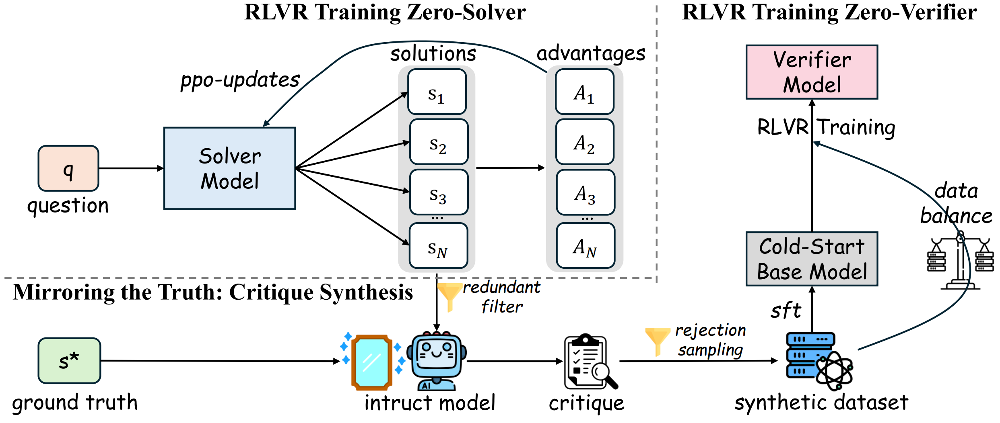
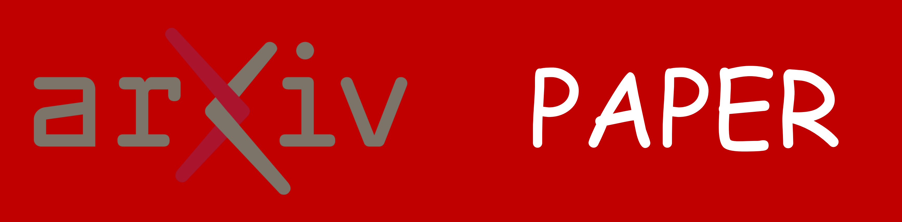

<div align="center">


<h1 style="display: flex; justify-content: center; align-items: center; gap: 10px; margin: 0;">
  Critique to Verify: Accurate and Honest Test-Time Scaling with RL-Trained Verifiers
</h1>
<p align="center"><em>RLVR training verifier with self-synthetic critique data to improve accuracy and honesty in test-time scaling.</em></p>
<div align="center">
  
</div>


<div align="center">
<a href="https://arxiv.org/abs/2509.23152"></a>
<a href="https://www.alphaxiv.org/abs/2509.23152"></a>
<a href="https://github.com/yangzhch6/Mirror-Critique"></a>
<a href="https://huggingface.co/collections/yangzhch6/mirror-critique-68db792881323b0800d9f32b"></a>
</div>

</div>


# ✨Installation
```
pip install -e ./verl
pip install packaging
pip install ninja
pip install flash-attn --no-build-isolation
pip install -e .
```

# 📃Prepare Data
dowload from 'yangzhch6/Mirror-Critique'
```
huggingface-cli download yangzhch6/Mirror-Critique --local-dir ./data
```

> We have already provided the trajectories (with redundancy filtering) of the training procudure of Zero-RL Solver in `./data/to_critique/Qwen2.5-Math-{1.5/7}B-L-openr1-f3/to_critique.parquet`. Also, the test-time output of Zero-RL Solver are shown in `./data/rlvr-critique/Qwen2.5-Math-{1.5/7}B-L-openr1-f3/test_n16_full.parquet`


# 🔧Train Mirror-Verifier

## Gen Critique
```
bash ./experiments/gen_critique/Qwen2.5-7B-Instruct-to-Qwen2.5-Math-{1.5/7}B.sh
```

## SFT Cold Start
```
bash ./experiments/sft_critique/Qwern2.5-Math-{1.5/7}B-L.sh
```

## RVLR Train Verifier
```
bash ./experiments/rlvr-verify/Qwen2.5-Math-{1.5/7}B-L-sft-ckpt-balance-bsz1k.sh
```

## Evaluation
The performance of test-time scaling can be evaluated with:
```
python ./test-time-eval.py
```


# Huggingface Models
# DARS Models
| **Model**                          | **Huggingface** |  **Base Model** |
|-----------------------------------|------------------|------------------|
| |
| Zero-Solver-Qwen2.5-Math-1.5B-L | https://huggingface.co/yangzhch6/Zero-Solver-Qwen2.5-Math-1.5B-L | [Qwen2.5-Math-1.5B](https://huggingface.co/yangzhch6/Qwen2.5-Math-1.5B-L) |
| Zero-Solver-Qwen2.5-Math-7B-L | https://huggingface.co/yangzhch6/Zero-Solver-Qwen2.5-Math-7B-L | [Qwen2.5-Math-7B](https://huggingface.co/yangzhch6/Qwen2.5-Math-7B-L) |
| | 
| Mirror-Verifier-1.5B | https://huggingface.co/yangzhch6/Mirror-Verifier-1.5B | [Qwen2.5-Math-1.5B](https://huggingface.co/yangzhch6/Qwen2.5-Math-1.5B-L) |
| Mirror-Verifier-7B | https://huggingface.co/yangzhch6/Mirror-Verifier-7B | [Qwen2.5-Math-7B](https://huggingface.co/yangzhch6/Qwen2.5-Math-7B-L) |


# 🌻Acknowledgement
This repo builds upon [veRL](https://github.com/volcengine/verl) and [deepscaler](https://github.com/agentica-project/rllm), and utilizes [vLLM](https://github.com/vllm-project/vllm) for inference. We utilize [Math-Verify](https://github.com/huggingface/Math-Verify) for math reasoning evaluation. We thank the open-source community for datasets and backbones, [OpenR1-Math-220k](https://huggingface.co/datasets/open-r1/OpenR1-Math-220k), [Qwen2.5-Math](https://github.com/QwenLM/Qwen2.5-Math), and [DeepSeek-R1](https://github.com/deepseek-ai/deepseek-r1) model. 

# 📬 Contact
For questions, feedback, or collaboration opportunities, feel free to reach out:
- Zhicheng Yang: yangzhch6@gmail.com

# Citation
If you find our model or code useful, please kindly cite our paper:
```bib
@misc{yang2025critiqueverifyaccuratehonest,
      title={Critique to Verify: Accurate and Honest Test-Time Scaling with RL-Trained Verifiers}, 
      author={Zhicheng Yang and Zhijiang Guo and Yinya Huang and Yongxin Wang and Yiwei Wang and Xiaodan Liang and Jing Tang},
      year={2025},
      eprint={2509.23152},
      archivePrefix={arXiv},
      primaryClass={cs.LG},
      url={https://arxiv.org/abs/2509.23152}, 
}
```